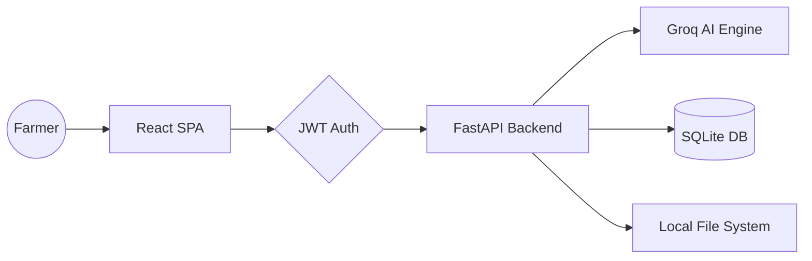

# HAL: Harvest Advancement & Intelligence Hub

HAL is a professional-grade precision agriculture platform designed to empower farmers with AI-driven insights. By integrating real-time crop monitoring, intelligent disease detection, and automated irrigation recommendations, HAL transforms traditional farming into a data-backed, high-yield operation.

## Table of Contents
- [Overview](#overview)
- [Key Features](#key-features)
- [Tech Stack](#tech-stack)
- [Architecture](#architecture)
- [Folder Structure](#folder-structure)
- [Installation Guide](#installation-guide)
- [Environment Variables](#environment-variables)
- [API Documentation](#api-documentation)
- [Usage](#usage)
- [Future Improvements](#future-improvements)

---

## Overview

### The Problem
Small and medium-scale farmers often lack access to affordable, high-tech tools for monitoring crop health, leading to unexpected losses due to diseases, water mismanagement, and lack of information on government support.

### The Solution
HAL (Harvest Advancement & Intelligence Hub) provides a centralized, easy-to-use dashboard that uses Artificial Intelligence to analyze crop data, predict weather-based needs, and offer a multilingual interface (English/Hindi) to bridge the digital divide in agriculture.

---

## Key Features

### AI & Intelligence
- **Disease Risk Detection**: AI-based analysis of crop images to identify early signs of infections or nutrient deficiencies.
- **Smart Irrigation Forecasting**: Predictive modeling of water requirements based on real-time weather data and soil conditions.
- **AI Farmer Assistant**: An integrated chatbot powered by Llama 3 models for instant agricultural advice and troubleshooting.

### User Experience
- **Live Farm Dashboard**: Real-time status indicators (Healthy, Needs Attention, Disease Risk) with health scores and progress tracking.
- **Bilingual Support**: Instant language toggle between English and Hindi with formal, government-portal-inspired translations.
- **Govt Schemes Portal**: A curated database of agricultural schemes and support programs for farmers.

### System Features
- **Secure Authentication**: JWT-based user sessions with city-level profile management.
- **Responsive Design**: Mobile-first UI optimized for use in the field on smartphones.
- **Digital Warehouse**: Persistent storage of crop history and farm growth data.

---

## Tech Stack

### Frontend
- **Framework**: React 18 (Vite + TypeScript)
- **Styling**: Tailwind CSS + shadcn/ui
- **Animation**: Framer Motion
- **Internationalization**: react-i18next
- **State Management**: Zustand
- **Icons**: Lucide React

### Backend
- **Framework**: FastAPI (Python)
- **Server**: Uvicorn
- **ORM**: SQLAlchemy
- **Authentication**: Python-JOSE (JWT), Passlib (Bcrypt)

### Database & Storage
- **Primary Database**: SQLite (Development)
- **Static Files**: FastAPI StaticFiles (serving audio and uploads)

### Integrations
- **AI Engine**: Groq API (Llama 3.1 models)
- **Utilities**: gTTS (Google Text-to-Speech) for audio accessibility

---

## Architecture




)

### Data Flow
1. **User Interaction**: Farmers interact with the dashboard or upload crop data via the React frontend.
2. **REST Layer**: All requests are handled by FastAPI routers (auth, crop, weather, etc.).
3. **Intelligence Layer**: Crop insights and chatbot responses are generated via Groq AI services.
4. **Persistence**: Data is securely stored in a local SQLite database using SQLAlchemy models.

---

## Folder Structure

```text
HAL/
├── backend/                # FastAPI Application
│   ├── models/             # SQLAlchemy Database Models
│   ├── routers/            # API Endpoints (auth, crop, chatbot, etc.)
│   ├── schemas/            # Pydantic Data Validation
│   ├── services/           # AI Insights & Irrigation Logic
│   ├── static/             # Audio and Uploaded Assets
│   └── main.py             # App Entry Point
├── frontend/               # React Application
│   ├── src/
│   │   ├── components/     # UI Sections (Dashboard, Navbar, FAQ)
│   │   ├── pages/          # Full Page Views (CatchUp, Schemes)
│   │   ├── store/          # Zustand State Management
│   │   ├── services/       # Axios API Integration
│   │   └── i18n.ts         # Language Configuration
│   └── public/locales/     # Translation JSON Files
└── .env                    # Environment Configuration
```

---

## Installation Guide

### Prerequisites
- Python 3.9+
- Node.js 18+
- npm or yarn

### Setup Steps

1. **Clone the Repository**
   ```bash
   git clone <repository-url>
   cd HAL
   ```

2. **Backend Setup**
   ```bash
   # It is recommended to use a virtual environment
   cd backend
   pip install -r requirements.txt
   ```

3. **Frontend Setup**
   ```bash
   cd ../frontend
   npm install
   ```

4. **Environment Configuration**
   Create a `.env` file in the root directory (using the variables listed below).

5. **Run the Application**
   - **Terminal 1 (Backend)**: `cd backend && python -m backend.main`
   - **Terminal 2 (Frontend)**: `cd frontend && npm run dev`

---

## Environment Variables

| Variable | Description | Example |
| :--- | :--- | :--- |
| `DATABASE_URL` | SQLAlchemy Connection URL | `sqlite:///./hal.db` |
| `SECRET_KEY` | JWT Secret Key | `your_super_secret_key` |
| `GROQ_API_KEY` | Groq AI API Key | `gsk_...` |
| `ALGORITHM` | JWT Hashing Algorithm | `HS256` |

---

## API Documentation

| Method | Endpoint | Description |
| :--- | :--- | :--- |
| **POST** | `/api/login` | Authenticate user and return JWT |
| **POST** | `/api/signup` | Register a new farmer account |
| **GET** | `/api/crops` | List all tracked crops for the user |
| **POST** | `/api/crops` | Register a new crop for monitoring |
| **GET** | `/api/weather/insights` | Get AI-generated agricultural insights |
| **POST** | `/api/chatbot/chat` | Interact with the AI Farmer Assistant |
| **GET** | `/api/schemes` | Retrieve current government schemes |

---

## Usage

1. **Onboarding**: Create an account and set up your profile including your city and farm location.
2. **Crop Management**: Add your crops (Wheat, Rice, etc.) to your "Digital Warehouse".
3. **Monitoring**: Check the Dashboard for real-time health scores and status indicators.
4. **Action**: Use the "Scan Your Crop" feature if a disease risk is detected to get instant AI analysis.
5. **Guidance**: Chat with the HAL AI assistant for any farming-related questions or irrigation planning.

---

## Future Improvements

- **Satellite Integration**: Incorporating real-time multispectral satellite imagery for larger farm tracking.
- **Offline Support**: PWA support for caching data when internet connectivity is intermittent in remote fields.
- **Market Price Connection**: Live integration with local market (Mandi) prices for crop sales optimization.
- **Disease Image Classifier**: Custom-trained ML model for identifying rarer crop diseases locally.

---

## License
MIT License

## Contact
Project developed for HAL - Harvest Advancement & Intelligence Hub.
